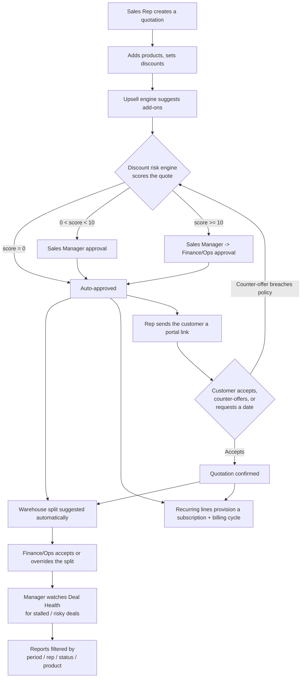
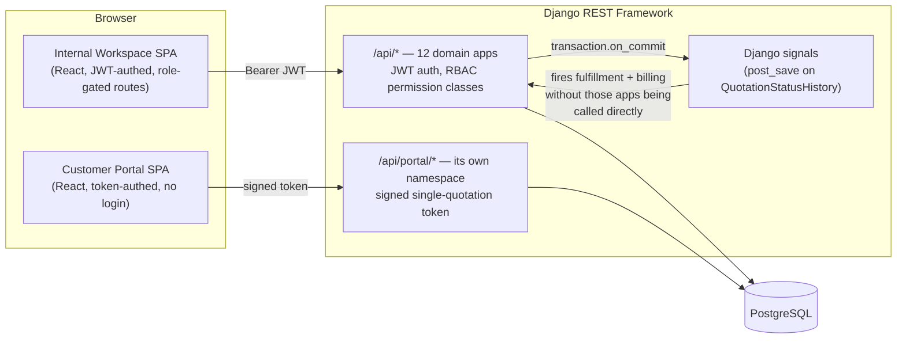
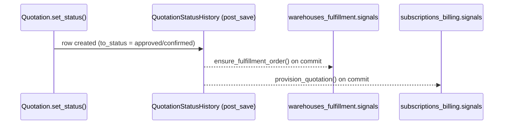

# DealFlow360

A full-lifecycle **Configure-Price-Quote (CPQ) and deal management platform** for a B2B sales organization — quoting, discount governance, multi-stage approval routing, warehouse fulfillment, recurring subscription billing, a self-serve customer negotiation portal, deal-health monitoring, and sales reporting, all wired together end to end.

Backend: **Django 5 / Django REST Framework** · Frontend: **React 18 / Redux Toolkit** · Database: **PostgreSQL**

---

## Contents

- [Overview](#overview)
- [Core deal lifecycle](#core-deal-lifecycle)
- [Architecture](#architecture)
  - [High-level view](#high-level-view)
  - [Multi-tenancy & RBAC](#multi-tenancy--rbac)
  - [Two independent auth systems](#two-independent-auth-systems)
  - [Backend apps](#backend-apps)
  - [Domain engines](#domain-engines)
  - [Signal-driven side effects](#signal-driven-side-effects)
  - [Frontend architecture](#frontend-architecture)
  - [Repository layout](#repository-layout)
- [Tech stack](#tech-stack)
- [Getting started](#getting-started)
- [Demo data](#demo-data)
- [API surface](#api-surface)

---

## Overview

DealFlow360 models the full life of a B2B deal, from a sales rep building a quote to the customer confirming it and the order shipping and billing. It exists to demonstrate — with working code, not a mock — how the pieces of a real quote-to-cash system actually connect:

- a **blended discount risk engine** that decides, per quote, whether it can be auto-approved or needs a human sign-off (and whether that sign-off needs Finance as well as a Sales Manager);
- a **warehouse split optimizer** that turns an approved order into a concrete shipment plan across multiple warehouses, flagging shortfalls as backorders;
- a **subscription billing engine** that separates one-time and recurring lines on the same order and raises the correct invoices and billing cycles for each;
- a **customer portal** that lets the buyer negotiate a quote directly — with any out-of-policy counter-offer automatically re-opening internal approval, with no one having to resubmit anything;
- a **deal health scanner** that surfaces stalled, over-discounted, or slipping deals before a manager has to go looking for them;
- and a **reporting dashboard** with export, so a manager can see the pipeline by period, rep, approval status, and product.

Four internal roles collaborate on the same company's pipeline (**Sales Rep, Sales Manager, Finance/Ops, Admin**), and the customer never gets a workspace login at all — just a single-quotation, time-limited link.

## Core deal lifecycle



## Architecture

### High-level view



There is **no task queue** (no Celery/Redis) — every cross-module side effect (opening a fulfillment order, provisioning a subscription) runs synchronously in-process via Django signals deferred to `transaction.on_commit`, so it fires only after the triggering change has actually committed, and can never roll back the change that caused it.

### Multi-tenancy & RBAC

`Company` is the tenant root — every business record hangs off one. A `User` (internal staff only; customers are a separate model) can hold a `Membership` — `user × company × role` — so the same login could, in principle, act inside more than one company. Every RBAC and data-scoping decision in the codebase reads from the current request's resolved `Membership`, never straight off the request's `User`.

| Role | Can do |
|---|---|
| **Sales Rep** | Build and own their own quotations; see only their own pipeline |
| **Sales Manager** | First-line approval; sees the whole company's pipeline; Reports; Deal Health |
| **Finance / Ops** | Second-line approval on high-risk quotes; accept/override warehouse splits; manage stock |
| **Admin** | Everything above, plus product catalog, discount/approval-chain configuration, warehouses, subscription plans, upsell rules |

A Sales Rep's queries are silently scoped to their own `owner` field wherever it matters (quotations, approvals, fulfillment) — one shared helper (`accounts.scoping.scope_to_owner`) applies this everywhere so the rule can't be forgotten on one screen and not another.

### Two independent auth systems

1. **Staff auth** — standard JWT (`djangorestframework-simplejwt`), issued at `/api/auth/login`, refreshed and blacklisted on rotation.
2. **Customer portal auth** — a signed, single-quotation token (`django.core.signing`), minted by a rep from inside the workspace (`POST /api/quotations/{id}/generate-portal-link`). Only the token's **hash** is ever stored, so a link can be shown once and never recovered — regenerating it silently revokes the old one. No customer account or password is required to view/negotiate a quote; an *optional* customer login exists separately for a "my quotations" view. The two systems share no session, cookie, or store, and touch in exactly one direction: an authenticated staff member mints a portal token, never the other way around.

### Backend apps

| App | Owns |
|---|---|
| `accounts` | Tenancy (`Company`), staff `User`/`Membership`/`Role`, `Customer` records, signup/login |
| `catalog` | Products, variants, price lists |
| `pricing_discounts` | Discount tiers, category ceilings, approval chain rules, **the blended discount risk engine** |
| `quotations` | The `Quotation` record itself — lines, status machine, status history |
| `approvals` | Turns a risk assessment into an approval cycle; records Manager/Finance sign-off, rejection, or return-to-draft |
| `warehouses_fulfillment` | Warehouses, stock levels, **the warehouse split optimizer**, backorders, replenishment watcher |
| `subscriptions_billing` | Subscription plans, **recurring billing engine**, billing cycles, proration/cancellation rules |
| `invoicing_payments` | Invoices, invoice lines, payments, credit notes |
| `upsell` | Cross-sell/upsell pairing rules and co-purchase scoring |
| `deal_health` | **Anomaly scanner** — stalled deals, discount anomalies, delivery slippage — plus escalate/nudge actions |
| `portal` | The customer-facing negotiation surface: magic-link sessions, counter-offers, delivery-date requests, confirmation |
| `reporting` | Aggregated sales analytics with filters, and PDF/XLS export |
| `audit_log` | A single `record()` helper and `AuditEntry` model used by every app above to write an immutable "who did what, when, why" trail |

### Domain engines

These four modules are the parts of the system that make an actual decision, rather than just storing a record:

- **Blended Discount Risk Engine** (`pricing_discounts.services.compute_risk`) — for every line, the effective ceiling is `min(customer tier's max discount %, that line's category ceiling)`. The overage above that ceiling is weighted by line value into a *blended* score, and compared against the *worst single line's* overage — the routing score is the greater of the two, so one badly-discounted line can never hide inside an otherwise-clean quote. A chain-rule table (admin-configurable) maps score ranges to `none` / `manager` / `manager_then_finance`.
- **Warehouse Split Optimizer** (`warehouses_fulfillment.services`) — automatically fires the moment a quote reaches `approved`/`confirmed` (via signal), packs each line's quantity into the cheapest warehouse(s) first, and flags any unfulfillable remainder as a backorder. Finance/Ops can accept the suggestion outright or manually override the per-warehouse quantities.
- **Subscription Billing Engine** (`subscriptions_billing.services`) — a `QuotationLine` is automatically `recurring` if its product is flagged as a subscription product; on approval/confirmation it provisions a `Subscription` and its first `BillingCycle`, while one-time lines land on the same order's `Invoice` — one order can carry both.
- **Deal Health Scanner** (`deal_health.services.run_deal_health_scan`) — flags quotations idle >3 days, line discounts >15%, and backordered fulfillment orders, each with a severity and a recommended action.

### Signal-driven side effects

Every quotation status change funnels through exactly one method — `Quotation.set_status()` — which writes one `QuotationStatusHistory` row per transition. Two entirely separate apps listen for that same row without knowing about each other:



The approval chain, the auto-approve fast path, and the portal's own customer-confirm action all trigger this identically — none of them import or call `warehouses_fulfillment` or `subscriptions_billing` directly.

### Frontend architecture

React 18 + Vite, **Redux Toolkit** for state with a single **RTK Query** `apiSlice` (tag-based cache invalidation, one `fetchBaseQuery` with automatic JWT refresh-on-401), **React Router v6**, **Tailwind CSS**.

The codebase actually ships **two separate single-page apps** from one repo:

- the **internal workspace** (`/`, `/login`, `/dashboard`, `/quotations`, …) — JWT-authed, its sidebar nav filtered live by the signed-in user's role;
- the **customer portal** (`/portal/*`) — token-authed, mounted with its own router and its own tiny Redux store (`portalStore.js`) in `main.jsx`, sharing no auth state with the workspace at all.

Feature folders under `frontend/src/features/` map roughly one-to-one to the backend apps above (`quotations/`, `approvals/`, `fulfillment/`, `subscriptions/`, `dealHealth/`, `reporting/`, `portal/`, `admin/`), each owning its own RTK Query endpoints file (`*Api.js`) and page components.

### Repository layout

```
DealFlow360/
├── backend/
│   ├── accounts/                # tenancy, users, roles, RBAC
│   ├── catalog/                 # products, variants, price lists
│   ├── pricing_discounts/       # discount governance + risk engine
│   ├── quotations/               # the deal record
│   ├── approvals/               # approval chain
│   ├── warehouses_fulfillment/  # split optimizer, backorders
│   ├── subscriptions_billing/   # recurring billing engine
│   ├── invoicing_payments/      # invoices, payments, credit notes
│   ├── upsell/                  # cross-sell rules
│   ├── deal_health/              # anomaly scanner
│   ├── portal/                  # customer magic-link negotiation
│   ├── reporting/               # analytics + export
│   ├── audit_log/               # shared audit trail
│   ├── dealflow360/             # settings, root urls
│   ├── manage.py
│   └── requirements.txt
│   # every app above also owns a `management/commands/seed_<app>.py` —
│   # see Demo data below
└── frontend/
    ├── src/
    │   ├── app/                 # store, router, layout
    │   ├── auth/                 # login/signup (workspace)
    │   ├── features/            # one folder per domain, mirrors backend apps
    │   └── shared/               # apiSlice, format helpers, UI primitives
    └── package.json
```

## Tech stack

| Layer | Choice |
|---|---|
| Backend framework | Django 5.0, Django REST Framework 3.15 |
| Auth | `djangorestframework-simplejwt` (staff), signed tokens via `django.core.signing` (customer portal) |
| Database | PostgreSQL (native install, no Docker) |
| Reports export | `openpyxl` (XLSX), `reportlab` (PDF) |
| CORS | `django-cors-headers` |
| Frontend framework | React 18 + Vite |
| State / data-fetching | Redux Toolkit + RTK Query |
| Routing | React Router v6 |
| Styling | Tailwind CSS |

## Getting started

**Prerequisites:** Python 3.10+, Node 22+, PostgreSQL (running locally, no Docker required).

```bash
# 1. Database
createdb dealflow360   # or via psql/pgAdmin

# 2. Backend
cd backend
python -m venv .venv
.venv\Scripts\activate        # Windows
# source .venv/bin/activate   # macOS/Linux
pip install -r requirements.txt
cp .env.example .env          # then fill in POSTGRES_PASSWORD etc.
python manage.py migrate
python manage.py seed_all      # optional but recommended — see Demo data
python manage.py runserver     # http://localhost:8000

# 3. Frontend (separate terminal)
cd frontend
npm install
npm run dev                    # http://localhost:5173
```

## Demo data

`python manage.py seed_all` runs every app's seed command in dependency order and is fully **idempotent** — safe to re-run any time — building out:

- 4 sales reps, a Sales Manager, a Finance/Ops user, and an Admin (all `password: DealFlow!2026`)
- 6 customers spread across Bronze/Silver/Gold tiers
- a product catalog with hardware, software, and subscription items, price lists, discount tiers, category ceilings, and approval chain rules
- a spread of quotations across every status (draft, auto-approved, pending at both approval levels, approved, rejected, returned-to-draft, confirmed) and across a multi-week date range, so filtering by period/rep/status/product actually has something to show
- warehouses with staggered stock (forcing single-shipment, split, and backorder outcomes), subscriptions with live billing cycles, and a live customer-portal link
- Deal Health anomaly alerts generated from that same data

Each app's seed command can also be run individually (`python manage.py seed_<app>`) if you only need to reset one slice.

## API surface

All endpoints live under `/api/`, JWT-authenticated unless noted, except the portal namespace.

| Prefix | App | Covers |
|---|---|---|
| `/api/auth/` | `accounts` | signup, login, refresh, logout |
| `/api/` (accounts) | `accounts` | company members, customers |
| `/api/` (catalog) | `catalog` | products, variants, price lists |
| `/api/` (pricing) | `pricing_discounts` | discount tiers, category ceilings, approval chain config |
| `/api/quotations/` | `quotations` | CRUD, lines, bulk discount, submit-for-approval, generate-portal-link |
| `/api/approvals/` | `approvals` | list/detail, approve, reject, return |
| `/api/fulfillment/` | `warehouses_fulfillment` | orders, accept-split, override, consolidate, notify, replenishment scan |
| `/api/` (subscriptions/invoices) | `subscriptions_billing`, `invoicing_payments` | plans, subscriptions, invoices, payments, credit notes |
| `/api/` (upsell) | `upsell` | upsell rules, per-quote suggestions |
| `/api/` (deal health) | `deal_health` | alerts, scan, escalate, nudge |
| `/api/reports/` | `reporting` | `summary`, `export?format=pdf|xls` (Sales Manager/Admin only) |
| `/api/portal/` | `portal` | **token-authed, no JWT** — quotation view, comment, counter-offer, delivery-date request, confirm |
